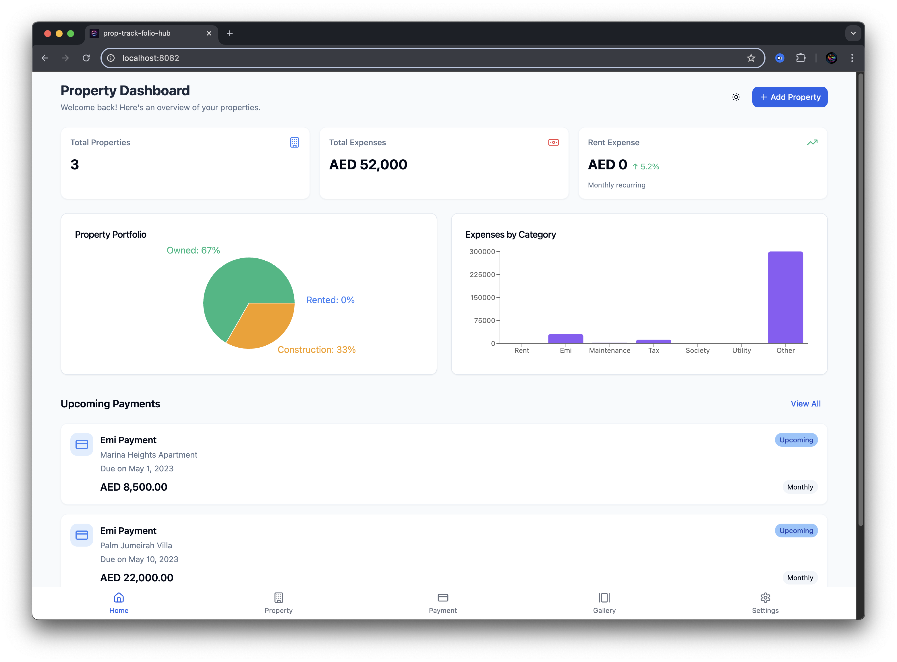
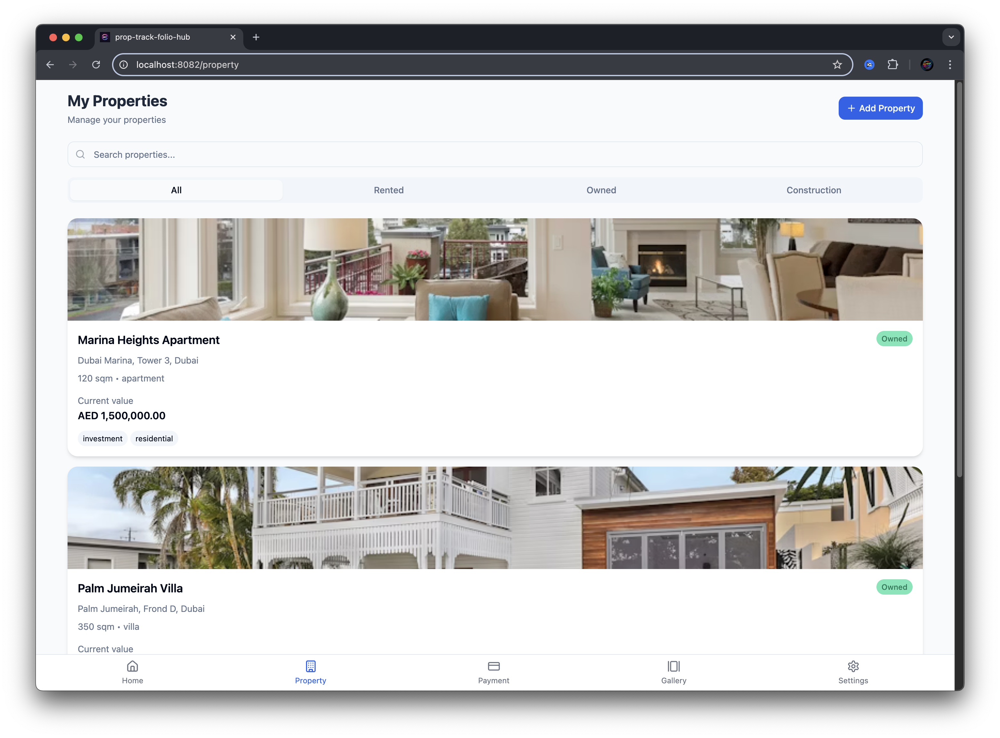
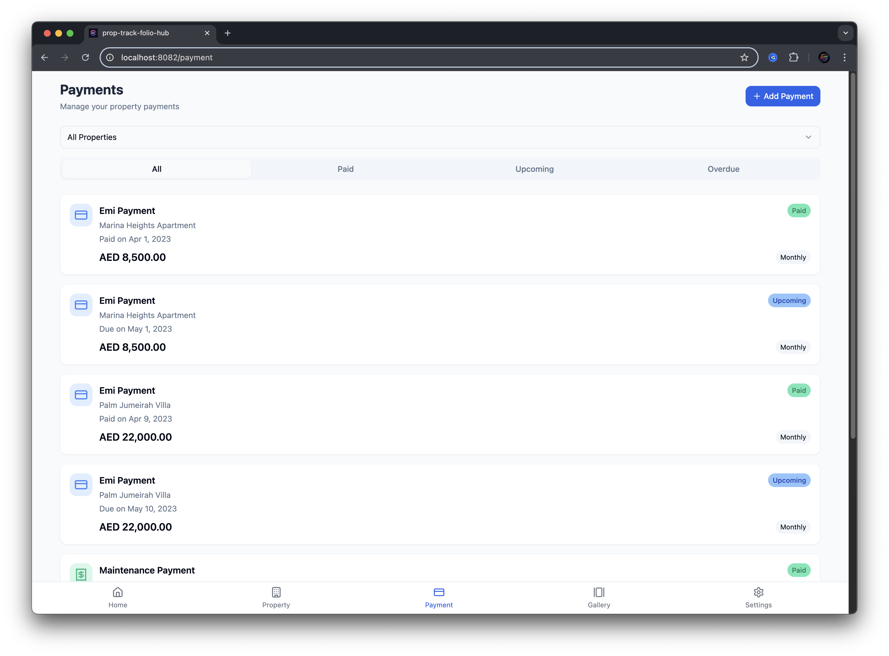
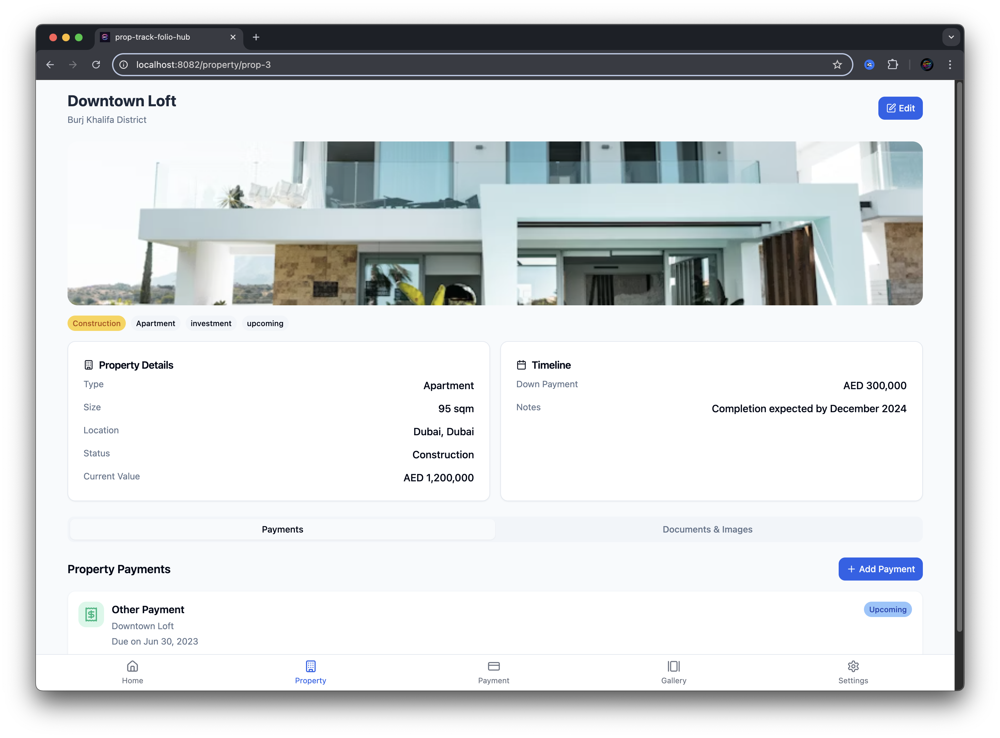
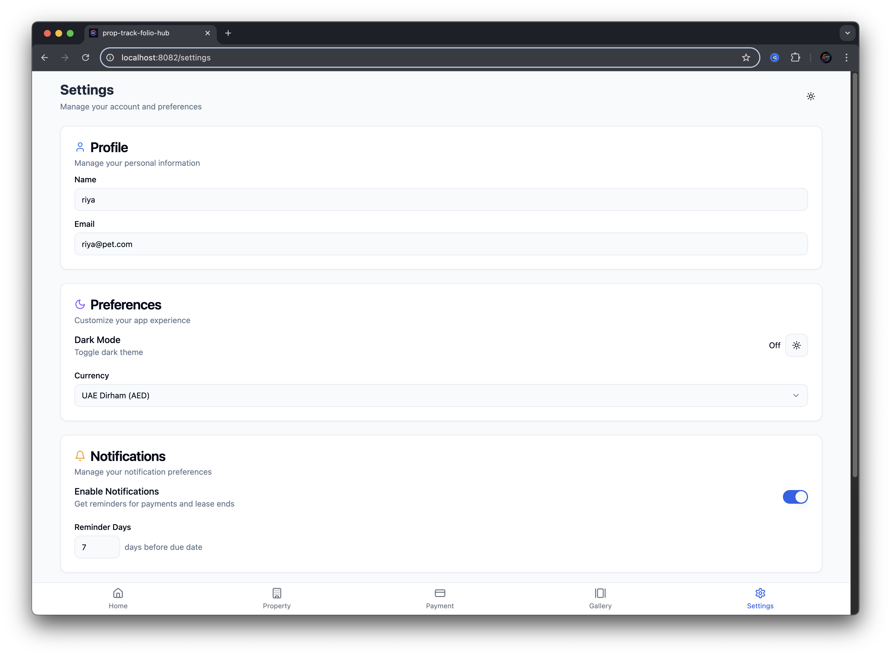

# Welcome to your Property Xpense Tracker

## Project info

**URL**: https://pet.imdadareeph.com

## How can I edit this code?

There are several ways of editing your application.

**Property Xpense Tracker**

Simply visit the [Property Xpense Tracker](https://pet.imdadareeph.com) and explore.


**Use your preferred IDE**

If you want to work locally using your own IDE, you can clone this repo and push changes. 

The only requirement is having Node.js & npm installed - [install with nvm](https://github.com/imdadareeph/uae-property-expense)

Follow these steps:

```sh
# Step 1: Clone the repository using the project's Git URL.
git clone https://github.com/imdadareeph/uae-property-expense.git

# Step 2: Navigate to the project directory.
cd uae-property-expense

# Step 3: Install the necessary dependencies.
npm i

# Step 4: Start the development server with auto-reloading and an instant preview.
npm run dev
```

**Edit a file directly in GitHub**

- Navigate to the desired file(s).
- Click the "Edit" button (pencil icon) at the top right of the file view.
- Make your changes and commit the changes.

**Use GitHub Codespaces**

- Navigate to the main page of your repository.
- Click on the "Code" button (green button) near the top right.
- Select the "Codespaces" tab.
- Click on "New codespace" to launch a new Codespace environment.
- Edit files directly within the Codespace and commit and push your changes once you're done.

## What technologies are used for this project?

This project is built with:

- Vite
- TypeScript
- React
- shadcn-ui
- Tailwind CSS

## Screenshots

### Dashboard Overview

*Main dashboard showing property statistics, expenses breakdown, and upcoming payments*

### Expense Tracking

*Detailed expense tracking and categorization*

### Reports & Analytics

*Financial reports and analytics dashboard*

### Mobile Responsive Design

*Fully responsive design optimized for mobile devices*


### Property Management

*Property listing and management interface*